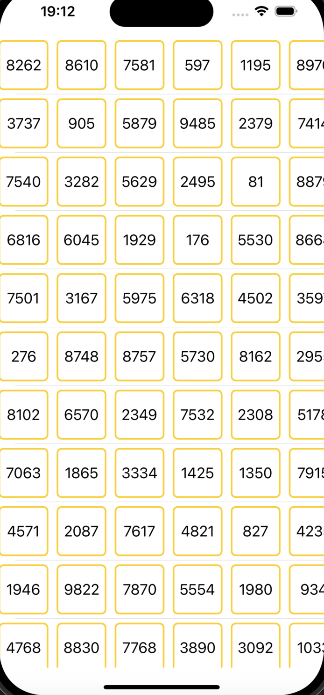
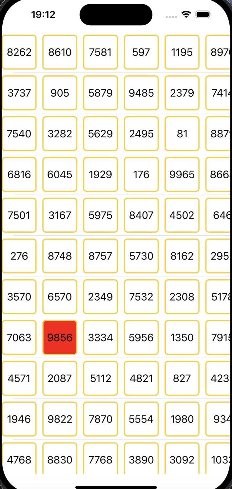

# Задача:

- Сделать вертикальный список на рандомное количество элементов (больше 100 - без верхней границы).
- В каждом элементе вертикального списка – горизонтальный список на рандомное количество элементов (больше 10). Каждая ячейка – квадратик с бордером и скругленными углами (произвольный радиус), отображающий случайное число. При тапе на квадратик он должен анимировано уменьшаться на 20% (при тапе уменьшаться, при отпускании возвращаться к прежним размерам) Раз в секунду обновляется одно случайное число во всех горизонтальных списках (только в видимой области).

# Обязательные требования:

- UIKit
- Deployment target 14

# Пожелания:
- Обратить внимание на производительность решения.
- Можно не запариваться по поводу переворотов экрана и сохранением стейта.

# Несколько слов о реализации
- Не стал использовать какую либо архитектуру, так как по большому счету бизнесс логики в прложении нету, в основном работа с UI. Разделил файлы на View и SupportingFiles и вынес сториборды в отдельную папку
- Использовал SnapKit для констрейнтов и SPM, чтобы доавить SnapKit
- Добавил временное подсвечивание ячейки в которой будет происходить изменение номера, чтобы проще было визуально отследить поведение
- 

# Небольшое preview

